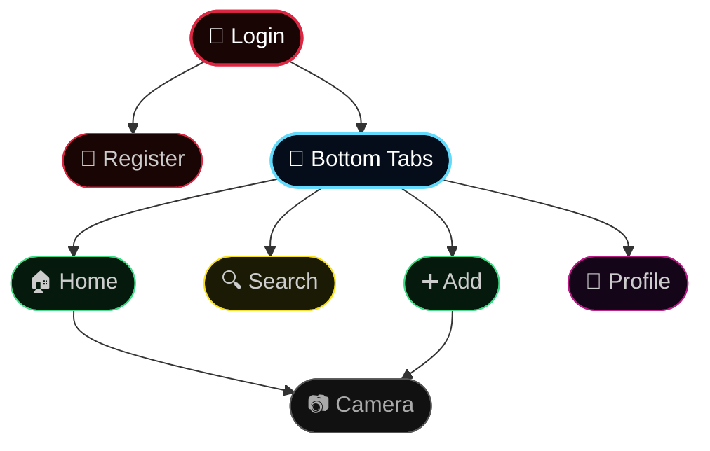

<div align="center">


</div>

<div align="center">


<br/>

[](https://reactnative.dev)
[](https://developer.mozilla.org/en-US/docs/Web/JavaScript)
[](https://developer.android.com)
[](https://developer.apple.com)

<br/>

[](.)
[](.)
[](.)
[](.)

<br/>

**[`🌟 About`](#-about-the-project)** &nbsp;•&nbsp;
**[`🎨 Screens`](#-visual-summary--navigation)** &nbsp;•&nbsp;
**[`🗺️ Map`](#️-interaction-map)** &nbsp;•&nbsp;
**[`🏗️ Layout`](#️-project-layout)** &nbsp;•&nbsp;
**[`🚀 Setup`](#-getting-started)**

</div>

<br/>

---

<br/>

## 🌟 About The Project

> **Insta Lite** is a highly polished, zero-bloat mobile application inspired by Instagram.
> It strips away the noise and focuses on clean interactions, a seamless dark UI, and optimal performance — without relying on heavy third-party UI libraries.

<br/>

<div align="center">

| &nbsp; | Feature | Description |
|:---:|:---|:---|
| 🔐 | **Authentication** | Beautiful login & registration flows with graceful state handling |
| 📱 | **Dynamic Feed** | Browse stories and media cards with snappy, immersive scrolling |
| ❤️ | **Interactions** | Heart animations, double-tap to like, and emoji reactions (`❤️` `💬` `✈️`) |
| 📷 | **Camera UI** | Custom mock camera wrapper handling permissions gracefully |
| 👤 | **Profile View** | Stats, bio, and sleek symmetric media grid layouts |

</div>

<br/>

---

<br/>

## 🎨 Visual Summary & Navigation

<div align="center">

| Screen | Experience Highlights |
| :---: | :--- |
| **🏠 Home** | Dark feed cards with rounded immersive media, snappy scroll, double-tap support |
| **📖 Stories** | Circular avatars with the iconic warm gradient ring, horizontal scrolling |
| **📷 Camera** | Pure black sleek UI, close action, smooth capture button layout |
| **👤 Profile** | Clean stats hierarchy, dynamic remote placeholders, symmetrical grids |

</div>

<br/>

---

<br/>

## 🗺️ Interaction Map



<br/>

---

<br/>

## 🏗️ Project Layout

```
📦 src
 └── 📂 screens
      ├── 🔐 LoginScreen.js       ←  Auth entry
      ├── 📝 RegisterScreen.js    ←  User onboarding
      ├── 🏠 HomeScreen.js        ←  Feed & Stories
      ├── 🔍 SearchScreen.js      ←  Explore page mock
      ├── ➕ AddScreen.js          ←  New post interceptor
      ├── 📷 CameraScreen.js      ←  Custom camera UI
      └── 👤 ProfileScreen.js     ←  User grid and stats
```

<br/>

---

<br/>

## 🚀 Getting Started

Follow these instructions to run the application on your local machine.

<br/>

### `01` &nbsp; Installation

> Clone the repo and install all dependencies.

```bash
npm install
```

<br/>

### `02` &nbsp; Start Metro Bundler

> Keep this terminal running in the background.

```bash
npx react-native start
```

<br/>

### `03` &nbsp; Launch the App

> Open a **new** terminal window and run for your target platform.

**▶ &nbsp; Android**

```bash
npx react-native run-android
```

**▶ &nbsp; iOS**

```bash
npx react-native run-ios
```

<br/>

---

<br/>

<div align="center">

*✦ &nbsp; Built with* ❤️ *to celebrate visual clarity and interaction smoothness &nbsp; ✦*

<br/>


</div>
