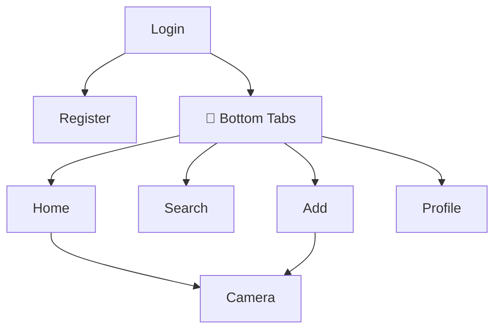

<div align="center">


# Insta Lite

**A lightweight, smooth, and minimalist Instagram clone.**<br/>
*Built with React Native CLI for Android & iOS.*

<p align="center">
  
  
  
  
</p>

[Explore](#-about-the-project) • [Installation](#-getting-started) • [Architecture](#️-project-layout) • [Next Steps](#-next-steps)

</div>

<br/>

<hr align="center" style="border: 1px solid #e0e0e0; width: 80%" />

## 🌟 About The Project

**Insta Lite** is a highly polished, zero-bloat mobile application inspired by Instagram. 
It strips away the noise and focuses on clean interactions, a seamless dark UI, and optimal performance without relying on heavy third-party UI libraries.

### ✨ Core Features
- 🔐 **Authentication**: Beautiful login & registration flows.
- 📱 **Dynamic Feed**: Browse stories and media cards seamlessly.
- ❤️ **Interactive Elements**: Heart animations, double-tap to like, and emoji interactions (`❤️`, `💬`, `✈️`).
- 📷 **Camera Interface**: A custom mock camera wrapper handling permissions gracefully.
- 👤 **Profile View**: Stats, bio, and sleek media grid layouts.

---

## 🎨 Visual Summary & Navigation

| Screen | Experience Highlights |
| :---: | :--- |
| **🏠 Home** | Dark feed cards with rounded immersive media, snappy scroll, double-tap support. |
| **📖 Stories** | Circular avatars with the iconic warm gradient ring, horizontal scrolling. |
| **📷 Camera** | Pure black sleek UI, close action, smooth capture button layout. |
| **👤 Profile** | Clean stats hierarchy, dynamic remote placeholders, symmetrical grids. |

---

## 🗺️ Interaction Map



---

## 🏗️ Project Layout

```bash
📦 src
 ┗ 📂 screens
   ┣ 📜 LoginScreen.js      # Auth entry
   ┣ 📜 RegisterScreen.js   # User onboarding
   ┣ 📜 HomeScreen.js       # Feed & Stories
   ┣ 📜 SearchScreen.js     # Explore page mock
   ┣ 📜 AddScreen.js        # New post interceptor
   ┣ 📜 CameraScreen.js     # Custom camera UI
   ┗ 📜 ProfileScreen.js    # User grid and stats
```

---

## 🚀 Getting Started

Follow these instructions to run the application on your local machine.

### 1. Installation
Clone the repo and install dependencies:
```bash
npm install
```

### 2. Start Metro Bundler
Keep this running in the background:
```bash
npx react-native start
```

### 3. Launch App
Open a new terminal window and run:

**For Android:**
```bash
npx react-native run-android
```
**For iOS:**
```bash
npx react-native run-ios
```

---

## 🔮 Next Steps

We are constantly improving Insta Lite. Here's what's on the horizon:
- [ ] ☁️ **Backend Auth:** Real user session persistence.
- [ ] 📤 **Post Uploads:** Complete image upload pipeline.
- [ ] 💬 **Comments Engine:** Real-time commenting and tagging.
- [ ] 🔔 **Notifications:** Engagement alerts.

<br/>

<div align="center">
  <b>Built with ❤️ to celebrate visual clarity and interaction smoothness.</b>
</div>
