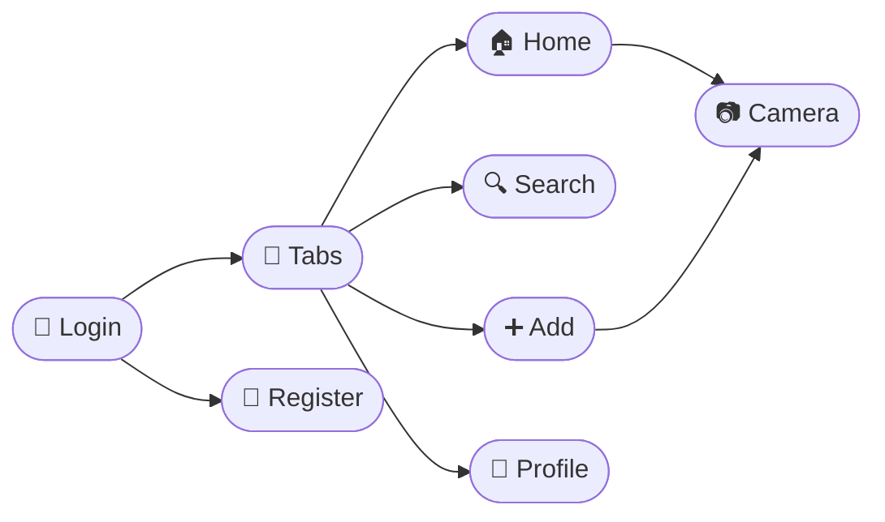

<div align="center">


<br/>
<br/>

<br/><br/>
<br/><br/>

[](https://reactnative.dev)
[](https://developer.mozilla.org)
[](https://developer.android.com)
[](https://developer.apple.com)

</div>

---

## 🌟 About

A zero-bloat Instagram-inspired app built with **React Native CLI**.  
Clean interactions, seamless dark UI, optimal performance.

| | |
|:---:|:---|
| 🔐 | Login & Register flows |
| 📱 | Dynamic feed & stories |
| ❤️ | Double-tap to like |
| 📷 | Custom camera UI |
| 👤 | Profile grid & stats |

---

## 🗺️ Flow



---

## 🚀 Quick Start

```bash
npm install
npx react-native start
npx react-native run-android
npx react-native run-ios
```

---

## 🏗️ Structure

```bash
📦 src / screens
  ├── LoginScreen.js
  ├── RegisterScreen.js
  ├── HomeScreen.js
  ├── SearchScreen.js
  ├── AddScreen.js
  ├── CameraScreen.js
  └── ProfileScreen.js
```

---

<div align="center">


</div>
